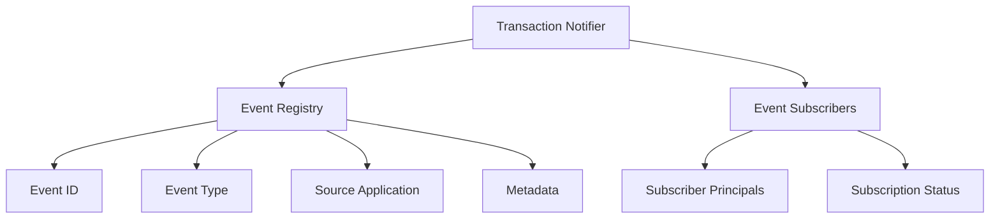

# # Notify Transaction: Cross-Application Event Tracking

A flexible Clarity smart contract for tracking, registering, and subscribing to transaction events across different applications and game environments.

## Overview

Notify Transaction provides a robust system for event tracking and notification, enabling developers to:

- Register unique transaction events
- Subscribe to specific event types
- Track event metadata across applications
- Create cross-platform event communication

## Key Features

- Flexible event type support (transfer, interaction, conversion)
- Event registration with detailed metadata
- Subscription and unsubscription mechanisms
- Secure, permission-based event management

## Architecture



## Quick Start

### Prerequisites
- Clarinet
- Stacks wallet
- Basic understanding of Clarity smart contracts

### Installation

1. Clone the repository
2. Install dependencies
```bash
clarinet install
```

3. Run tests
```bash
clarinet test
```

### Basic Usage

1. Register a transaction event:
```clarity
(contract-call? .transaction-notifier register-transaction-event
    "event-123"         ;; Unique event ID
    "transfer"          ;; Event type
    "my-game-platform"  ;; Source application
    "NFT transferred between games"  ;; Description
    (some "{\"details\": \"transfer metadata\"}"))  ;; Optional metadata
```

2. Subscribe to an event:
```clarity
(contract-call? .transaction-notifier subscribe-to-event "event-123")
```

## Function Reference

### Event Management
- `register-transaction-event`: Create a new transaction event
- `subscribe-to-event`: Subscribe to a specific event
- `unsubscribe-from-event`: Stop receiving event notifications

### Utility Functions
- `get-transaction-event`: Retrieve event details
- `is-event-subscriber`: Check subscriber status
- `set-contract-owner`: Transfer contract ownership

## Security Considerations

- Only contract owner can change ownership
- Event registration requires valid event types
- Subscription is open but can be managed by the event creator

### Limitations
- Event IDs limited to 50 characters
- Metadata limited to 1000 UTF-8 characters
- Supports three predefined event types

## Development

### Testing
```bash
clarinet test
```

### Local Development
1. Start Clarinet console
```bash
clarinet console
```

2. Deploy contracts
```bash
clarinet deploy
```

## Contributing

1. Fork the repository
2. Create a feature branch
3. Commit your changes
4. Push and create a pull request

## License

[Specify your license here]